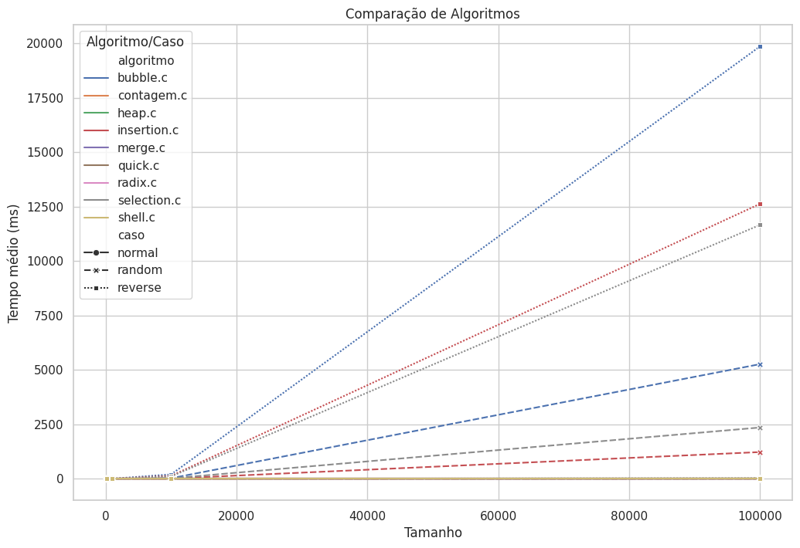
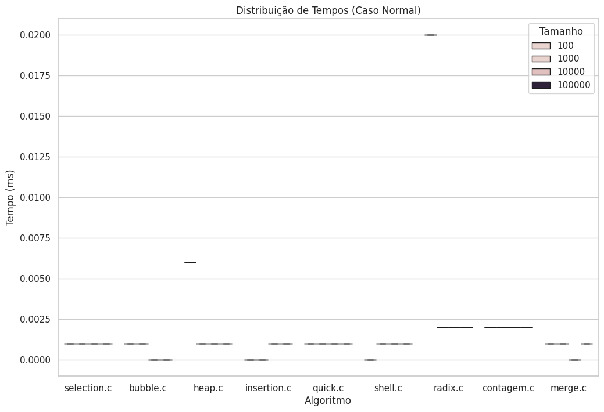
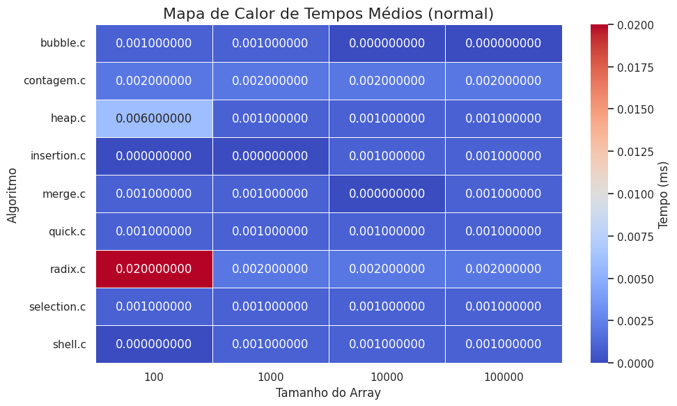
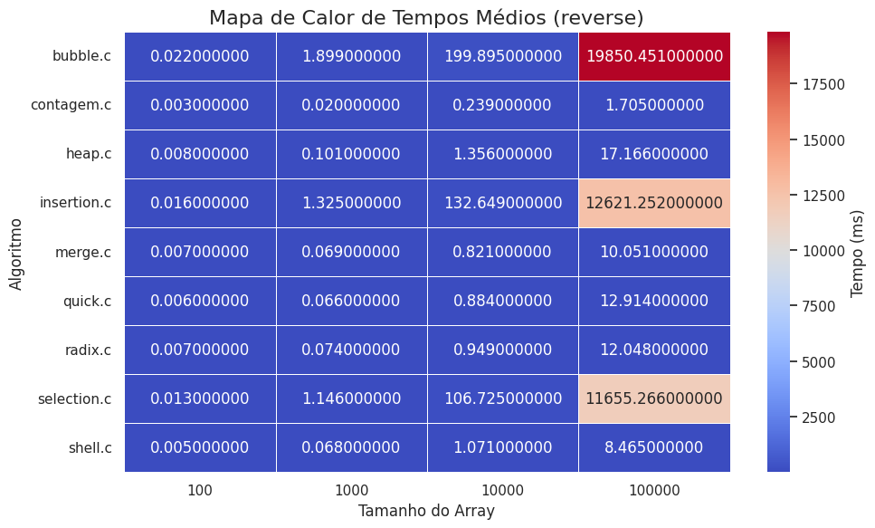
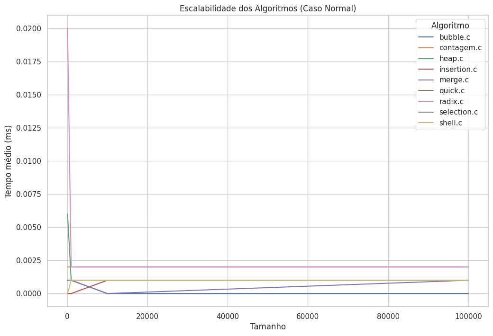

# Análise de algoritmos 

### Comparação

    

### Tempo total acumulado

    

### Distribuição dos casos

    

    

    

### Mapa de calor dos tempos de execução

    

    

    

### Variação dos algoritmos

    

    

    

